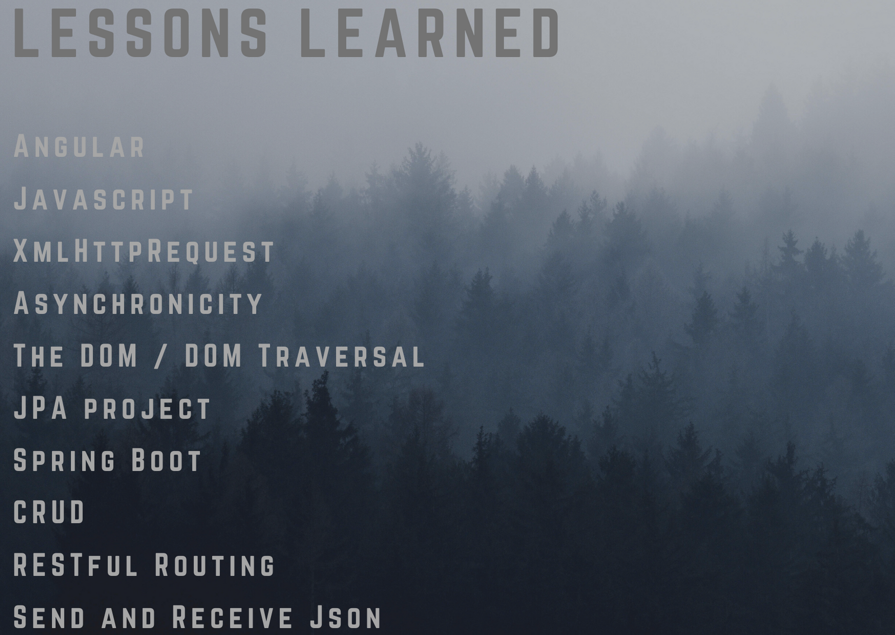

## Event Tracker Project

## Week 11-13 Project for Skill Distillery
- Reservation Tracker is a app to mirror a restaurant taking reservations for daily service.  

## Reservation Database

- Database Schema

- Database Contents

## API Endpoints

## Restaurant Reservation

## Technologies Used

## Lessons Learned

## AWS Address
- http://18.224.85.94:8080/ReservationTracker/api/reservation
